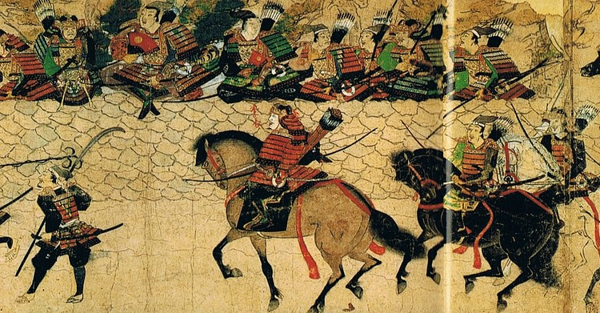
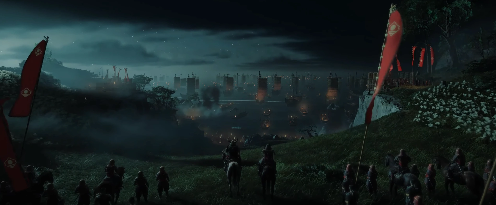

# 🗾 Invasions Mongoles au Japon (XIIIe siècle)

# Table des matières
1. [Contexte diplomatique et économique](#-contexte-diplomatique-et-économique)
2. [Menaces précédant les invasions](#️-menaces-précédant-les-invasions)
3. [La première invasion (1274)](#-la-première-invasion-1274)
4. [Tentative diplomatique](#-tentative-diplomatique)
5. [La seconde invasion (1281)](#-la-seconde-invasion-1281)
6. [Bilan](#-bilan)
7. [Légitimité du récit](#-légitimité-du-récit)
8. [Héritage culturel moderne](#-héritage-culturel-moderne)

## 🧭 Contexte diplomatique et économique
En 1274, l'[Empire Mongol](https://fr.wikipedia.org/wiki/Empire_mongol) vient d'intégrer les terres chinoises du sud et la Corée dans son immense territoire.  
Le Khan (titre de l'empereur mongol) souhaite maintenant s'attaquer au Japon, dernier archipel important de la région. Les raisons pour lesquelles le Khan s'intéressait au Japon sont incomplètement documentées, mais des suppositions sont émises par les historiens.

D'abord, le [Japon](https://fr.wikipedia.org/wiki/Shogunat_de_Kamakura) était réputé pour être une "terre d'or" d'après les dires du voyageur vénitien Marco Polo, bien que cette affirmation relève davantage de la légende que d'une information fiable.  
De plus, le Japon était un partenaire commercial de la partie restante de la Chine au sud, ce qui posait problème aux Mongols.  
Enfin, la possibilité que ces invasions aient été aussi motivées par une volonté de prestige n'est pas à exclure.

## ✉️ Menaces précédant les invasions
Avant la première invasion de 1274, le Khan tente en vain de soumettre le Japon, alors dirigé par le shogunat Kamakura.  
Il demande au pays de lui verser une somme régulièrement (tribut), autrement dit, il souhaite vassaliser l'île nipponne.  
Cependant, le shogunat refusait de donner la moindre réponse aux injonctions du Khan, ce qui n'a pas manqué d'accroître la tension entre les deux empires.  
Du point de vue du shogunat Kamakura, le Japon était en capacité de repousser une invasion, ce qui renforçait la position du pays.

## ⚓ La première invasion (1274)
En novembre 1274, la première invasion débute. Le Khan mobilise une flotte d'environ 800 bâtiments en Corée afin de préparer l'invasion navale de l'île.

En tout, cette monstrueuse armée comptait entre 15 000 et 40 000 hommes, et était composée non seulement de soldats mongols mais aussi de conscrits des territoires conquis par l'empire, comme la Chine ou la Corée.  
Les premières îles visées par ces invasions ont été Tsushima et Iki.

Ces attaques, bien que représentant une importante puissance de feu, rencontrent une résistance à la hauteur, notamment à Tsushima, où le gouverneur So Sukekuni dirigeait la défense.

Bien que la défense des Japonais ait eu un sérieux impact sur l'issue des combats, les Mongols, largement supérieurs en nombre, ont finalement réussi à prendre le contrôle de l'île de Tsushima.

Par la suite, les Mongols passent par l'île de Takashima afin d'arriver jusqu'à la baie de Hakata.

Le 19 novembre, les troupes du Khan démarrent l'attaque de la baie. Celle-ci, bien que protégée, était un territoire facilement attaquable (eaux peu profondes). Les Japonais étaient en infériorité numérique, donc la première bataille fut perdue. De plus, l'armement mongol était bien supérieur à celui des Nippons (arcs à double corne explosifs, mouvements de troupe très rapides basés sur les chevaux).

En face, les Japonais ont préféré laisser la place aux duels indépendants. Cependant, la vitesse des Mongols ainsi que leur coordination de groupe a causé de sérieuses difficultés.  
Près de 18 jours après le début de l'invasion, les Mongols sont incapables d'avancer dans le territoire japonais.

Les causes ne sont pas très bien établies. Cependant, on peut supposer que le ravitaillement était insuffisant et que la mort du général Lieu Fuxiang a porté un coup à l'armée mongole.

Une autre thèse existe également : elle suppose que cette invasion n'avait qu'un objectif de reconnaissance et non de conquête territoriale.

Dans la nuit du 20 novembre, les Mongols finissent par repartir vers la baie. Cependant, une tempête décime le tiers de leurs troupes lors de leur repli, ce qui porte un coup majeur sur leur armée et une partie de leurs navires.

## 🤝 Tentative diplomatique
Suite à la destruction d'une partie de son armée, le Khan se tourne vers la diplomatie. Il retente de demander un tribut en 1275 en envoyant un ambassadeur, que le shogunat décapite.  
Il recommence en 1279, mais cet ambassadeur est tué de la même manière que les autres.

La conclusion logique de ces provocations était claire du point de vue du Japon, qui refusait toute intégration directe ou indirecte à l'Empire.

Pour l'empereur mongol, c'était la goutte de trop : il comprend que le Japon ne se soumettra que par l'acier et le sang.

Cependant, après la première invasion, les Japonais ont compris la menace et se sont préparés depuis 1274. Des fortifications massives furent construites (19 km de long pour 3 m de haut).

## ⚔️ La seconde invasion (1281)

Cette fois, les Mongols mobilisent une armée encore plus massive que la première. Ils viennent de vaincre les Song (dynastie chinoise encore en place au sud du pays), cette victoire leur permet donc de réquisitionner la marine des Chinois.

En totalité, les forces mongoles représentent 4 400 navires et 100 000 hommes d'origines diverses, tous conquis par l'Empire (Chine, Corée).

Les premières attaques ont lieu le 9 juin à Tsushima et le 14 juin à Iki. Par la suite, le 23 juin, une nouvelle attaque est déclenchée à la baie de Hakata.

Cette fois-ci, les Mongols divisent leurs forces. Une des flottes attaque Honshu et est vaincue à Nagato.  
Au même moment, à Hakata, les Japonais maîtrisent leurs défenses et résistent héroïquement aux offensives des envahisseurs, à tel point que les Mongols n'arrivent pas à établir de camp sur la plage.

L'essentiel des combats se déroule sur les navires mongols.  
Les Japonais parviennent à oblitérer les guerriers mongols à tel point qu'ils se retirent progressivement des îles de Shiga, Noki et Iki.

C'est à ce moment que des navires japonais de petite taille lancent des raids sur les chaînes de ravitaillement mongoles afin de réduire les capacités offensives de ces derniers.

Face à cette situation catastrophique, le Khan mobilise environ 40 000 Chinois de plus et fusionne les deux armées pour tenter une offensive en fer de lance localisée afin d'entrer dans le territoire japonais, précisément dans la ville d'Hirado. Les attaques parviennent à avancer et se dirigent vers Takashima.

Cette ville est le témoin de combats longs de plusieurs semaines entre des Mongols affaiblis par le manque de ravitaillement et des Japonais enragés défendant leur île coûte que coûte. Le 14 août, un typhon détruit l'essentiel de la flotte mongole.

Ce typhon est non seulement dévastateur, mais casse la cohésion établie par les bâtiments mongols afin de contrer les raids japonais.

Cette catastrophe naturelle anéantit près des deux tiers des forces mongoles.  
Les restes de la flotte n'ont d'autre choix que de se retirer vers les côtes chinoises.

## 📜 Bilan
Les deux invasions se sont donc soldées par deux échecs. Mais par-dessus tout, elles ont été le théâtre de nombreuses morts côté mongol, chinois et coréen, et d'une défense héroïque de l'Empire du Japon, qui a consolidé sa position comme une île indomptable et même bénie des dieux pour le peuple nippon.  
Par-dessus tout, cette résistance et cette résilience resteront dans l'histoire de l'archipel nippon jusqu'à l'ère moderne et les conflits qui l'accompagnent.

| Invasion | Année | Issue     | Pertes       |
|----------|-------|-----------|--------------|
| Première | 1274  | Repoussée | 13 000 morts |
| Deuxième | 1281  | Repoussée | 150 000 morts|

**En bref, le Japon gagne sur les points suivants :**  
* Pertes bien moins importantes que l'ennemi  
* Prestige militaire  
* Mythe d'un peuple choisi des dieux  
* Valeurs de résistance et de courage  
* Renforcement de la légitimité politique du shogunat

## 📖 Légitimité du récit
Il est important de noter que le récit de ces événements repose sur des sources historiques diverses et anciennes.  
C'est donc la raison pour laquelle il est possible que certains chiffres aient été exagérés ou sous-estimés par les sources de l'époque.

De plus, ce récit a servi au Japon car il a permis de fédérer les Japonais autour d'un début d'identité nationale. Pour la première fois, l'entièreté des forces japonaises étaient engagées contre un seul ennemi, tout le pays était mobilisé à tel point que la victoire a été vue comme la preuve d'une intervention divine.

## 🎮 Héritage culturel moderne
  
Ces événements ont été utilisés par plusieurs ouvrages historiques, mais pas seulement.  
Dans le monde du jeu vidéo, les invasions mongoles du Japon ont été racontées dans un titre majeur : [*Ghost of Tsushima*](https://ghostfranchise.fandom.com/wiki/Ghost_of_Tsushima).  
Ce jeu vidéo a apporté un véritable coup de projecteur à ces événements historiques, à tel point qu'il a été salué chaleureusement par les critiques et les joueurs.

### Sources
https://www.worldhistory.org/trans/fr/2-1415/les-invasions-mongoles-du-japon-1274-et-1281/

https://fr.wikipedia.org/wiki/Invasions_mongoles_du_Japon

https://nouvelles.umontreal.ca/article/2024/08/30/l-enigme-des-invasions-mongoles-au-japon

